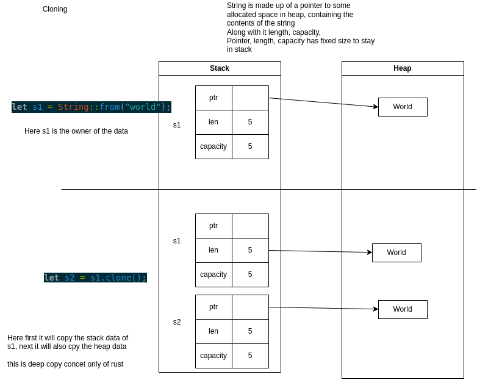

# OwnerShip in Rust

create the new package - 
```bash
cargo new section4-ownership 
# warning: the name `Section4-Ownership` is not snake_case or kebab-case which is recommended for package names, consider `section4-ownership`
```

The Book - official book for the rust language-
this covers all consepts very clearly -
https://doc.rust-lang.org/book/foreword.html


## Ownership Basics

1. Each value has a variable that's its "owner."
2. A value can have only one owner at a time. 
3. If the owner goes out of scope, the value is cleand up. 

Move the ownership
```rs

    let s1 = String::from("world");
    let s2 = s1; 
    //  println!("s1 is:{s1}")  // will give error

    // in above case under the hood this assignment is move or transfer of ownership from s1 to s2
    // "world" is a value and has variable that's it owner and can have only one owner at a time, so in line 2 s2 becomes the owner and s1 is removed from memory 
    // if try to access the s1 after the moved to s2 will give error  -- borrow of a moved value s1 (value borrowed here after move)


```


Don't move the value but copy it so want we can use s1 lateron
```rs

    let s1 = String::from("world");
    let s2 = s1.clone();
    println!("s1 is:{s1}");
    
```


when owner goes out of scope the value is dropped 
```rs

    let s1 = String::from("world");
    {
        let s2 = s1; 
    }
    //  println!("s2 is:{s2}")  // will give error can not find in this scope

    // in above case when inner scope ends, it will be popped out of the stack and memory it is pointing to will be immediatly freed up 
    // this prevents dangling pointers and memory leaks


```


When we assign the value of one variable to another. The value is being moved, leading to a change of ownership. However, this is not true for some primitive types.
```rs
    let x = 45;
    let y = x;
    println!("{x}");
    // this above will works because  in rust the primitives such as integers, floats, bools, and chars
    // are entirely stored on stack with no reference to heap, and they are copied and not moved by default.
    // Each copy has its separate owner.
```

## Ownership in functions 
Ownership in context of funtions works same as above, here are few examples- 

```rs

fn main() {

    // // case1- Moving ownership to the function 


    // like string are also heap allocated with a pointer length and capacity stored in stack
    let vec_1 = vec![1, 4, 5]
    takes_ownership(vec_1);
    // println!("vec_1 is: {:?}", vec_1); this will give error of borrowed of moved value
    // passing a variable has same effect as assigning a variable to another variable, i.e. ownership of vec_1 is transfered to the vec_fuc inside the funciton
    // vec_fun lives within the function scope at the end of the fuction it will be dropped (i.e. it will be cleaned up from heap)    

    // but if want to use vec_1 later, instead of passing the ownership to function insidea to vec_fun then use clone method  
    let vec_1 = vec![1, 4, 5]
    takes_ownership(vec_1.clone());
    println!("vec_1 is: {:?}", vec_1);
    // here we are not passing the ownership of the vec_1 to vec_fun but first cloning the vec_1 then sending the cloned copy to funtion - owner ship of the cloned copy is moved to vec_fun, and this ownership will be droped at the end of the function resultion in the dropping of the clone copy    


    // // case2- Moving ownership out of the function
    let vec_2 = gives_ownership();
    println!("vec_2 is: {:?}", vec_2);
    // in above case ownership is transfered from funtion to main() , and vec_2 will be dropped at the end of the main()


    // // case3 - takes and gives the ownership 
    let vec_3 = takes_and_gives_ownership(vec_2);
    // println!("vec_2 is: {:?}", vec_2);   // here we will get the error (borrowed of moved value) because we have transfred the ownership from vec_2 to function's vec_m_fun 
    println!("vec_3 is: {:?}", vec_3);
    // then this funciton returns the ownership of a variable which we are storeing in vec_3, so it is avaialble for use


    // // case4 - behaviour of stack only datatype
    let x=10;
    stack_function(x);
    println!("in main() x is : {x}");
    // unlike vactor we will be able to access the variable after passing to funtion -  because the stake only data types such as integers, floats, booleans, and chars are copied and not moved
    // so when we pass x to funtion a copy of it is created and assigned to the variable var inside the funciton 
    // these 2 variables x and var are two distinct values in stack, so update to the value inside the funciton does not impact the varialbe in main 
    


    //  imp note - taking an ownership by the function and giving it back is not something generally use in rust. Instead, use borrowing.
}


fn takes_ownership(vec_fun: Vec<i32>) {
    println!("vec_fun is: {:?}", vec)_fun;

}

fn gives_ownership() -> Vec<i32> {
    vec![4,5,6]
}

fn takes_and_gives_ownership(mut vec_m_fun: Vec<i32>) -> Vec<i32> {
    vec_m_fun.push(10);
    vec_m_fun
}

fn stack_function(mut var: i32) {
    var = 56;
    println!("in function var is : {var}");
}
```

### Practice on Ownership


Problem 1 and its variations - 

```rs
// Problem 1: Fix the code below so that it compiles

fn main() {
    let s1: String = String::from("this is me, ");
    let s2: &str = "Nouman";
    some_function(s1, s2); // Something is wrong here
    // Ans 
    // some_function(s1.clone(), s2.clone());    // this is a solution i give and this runs but there was no need to do s2.clone() only s2 would have worked
    // why? - &str is a reference: The reference itself (the & part) is a pointer, which is a fixed-size object. This pointer is stored on the stack.
    // 
    // the data of &str
    //  
    // let s: &str = "Hello, world!";    // Here, "Hello, world!" is a string literal, and s is a reference to that literal. The reference s is on the stack, while the data "Hello, world!" is in a read-only section of memory (program's binary - .rodata).
    // 
    // let s: String = String::from("Hello, world!");
    // let slice: &str = &s;
    // Here, s is a String (which owns its heap-allocated data), and slice is a reference to the string data. The reference slice is on the stack, but the data it points to is on the heap.


    //  Ans 2 - 
    // some_function(s1.clone(), s2);   // as s1 is heap-allocated type if pass s1 without clone s1 in main will be no longer valid after funciton call because it pass its owner ship to function's variable
    // Passing s2 to some_function does not transfer ownership, it just passes a reference. This means that the original s2 in main is still valid and usable after the function call.

    // Ans 3 - 
    // some_function(&s1, s2);    // Here, &s1 creates a reference to the String s1. This reference is a non-owning pointer to the data owned by s1. The String s1 is passed as a reference to some_function, so ownership remains with main, allowing you to use s1 after the function call.

    println!("{} {}", s1, s2);
}

// fn some_function(a1: &String, a2: &str) {      // part of ans 3 - updating the finrst input to reference String
fn some_function(a1: String, a2: &str) {
    println!("{} {}", a1, a2);
}

```

Problem 2 and it variations -- 

```rs
// Problem 2: 

/* 
Fix the code below. By solving this problem you will be able to understand 
the change of ownership inside a loop 
*/ 

fn main() {
    let mut my_vec = vec![1, 2, 3, 4, 5];
    let mut temp;

    while !my_vec.is_empty() {
        temp = my_vec; // Something wrong on this line
        // Ans - as in above code when we are doing temp = my_vec we are moving ownership of my_vec to the temp of current itteraion, so my_vec is no more avaialbe to use 
        // temp = my_vec.clone(); 
        println!("Elements in temporary vector are: {:?}", temp);


        if let Some(last_element) = my_vec.pop() { // pop() is used to remove an element from the vec
            println!("Popped element: {}", last_element);
        }
    }
}

// output 
// Elements in temporary vector are: [1, 2, 3, 4, 5]
// Popped element: 5
// Elements in temporary vector are: [1, 2, 3, 4]
// Popped element: 4
// Elements in temporary vector are: [1, 2, 3]
// Popped element: 3
// Elements in temporary vector are: [1, 2]
// Popped element: 2
// Elements in temporary vector are: [1]
// Popped element: 1


```

```rs


// concept 2 - lets try to print temp outside the loop
fn main() {
    let mut my_vec = vec![1, 2, 3, 4, 5];
    let mut temp;
    
    println!("{}",my_vec.len());
    
    while my_vec.len()!=1 {
        temp = my_vec.clone(); // Something wrong on this line
        println!("Elements in temporary vector are: {:?}", temp);


        if let Some(last_element) = my_vec.pop() { // pop() is used to remove an element from the vec
            println!("Popped element: {}", last_element);
        }
    }
    
    
    println!("Elements in temporary vector are: {:?}", temp); // this will give error -- error[E0381]: used binding temp is possibly-uninitialized

    // In Rust, a variable must be fully initialized before it can be used. The error E0381 occurs because the compiler cannot guarantee that temp has been initialized before it is used in the println! statement outside the loop.
    //  The issue with the final println! statement is the compiler cannot guarantee that the loop will run even once. If the loop doesn't run, temp will be uninitialized when you try to print it outside the loop. so in rust a variable must be fully initialized before it can be used

}

```

```rs 
fn main() {
    let mut my_vec = vec![1, 2, 3, 4, 5];
    let mut temp = vec![]; // Initialized to an empty vector to avoid uninitialized error
    
    while !my_vec.is_empty() {
        temp = my_vec.clone();
        println!("Elements in temporary vector are: {:?}", temp);

        if let Some(last_element) = my_vec.pop() {
            println!("Popped element: {}", last_element);
        }
    }

    println!("Elements in temp at end: {:?}", temp);
    println!("Elements in my_ves at end: {:?}", my_vec);
     // this code will run because - 
        //     Variable Defined Outside the Loop:

            // When a variable like temp is defined outside the loop, its scope covers the entire function (or block). This means:
            // Initialization: It is initialized only once.
            // Reassignment: In each iteration, temp is reassigned a new value.
            // Dropping: The previous value held by temp is dropped only when the variable itself is dropped. Since temp is not dropped at the end of each iteration (only its previous value is discarded), the variable itself remains valid until the end of the function.

}

```

```rs

fn main() {
    let mut my_vec = vec![1, 2, 3, 4, 5];

    while !my_vec.is_empty() {
        let temp = my_vec.clone(); // temp is initialized inside the loop
        println!("Elements in temporary vector are: {:?}", temp);

        if let Some(last_element) = my_vec.pop() {
            println!("Popped element: {}", last_element);
        }
    }
        // println!("Elements in temp at end: {:?}", temp); // will not work will give error - not found in this scope //  The variable is created and dropped in each iteration, limiting its lifetime to the iteration block
    println!("Elements in my_ves at end: {:?}", my_vec);
}


```


```rs
// Problem 3: Fix the code so that it compiles.


fn main() {
    {
        let str1 = generate_string();
    }
    let str2 = str1;   // Something wrong with this line
}

fn generate_string() -> String {
    let some_string = String::from("I will generate a string");
    some_string
}

```
solution 1- 

```rs
// Problem3 - Solution1: 
#[allow(unused_variables)] // this line will supress the warning of unused variables

fn main() {
    let str1 = {
        let str1 = generate_string();
        str1
    };
     
    let str2 = str1;  
}

fn generate_string() -> String {
    let some_string = String::from("I will generate a string");
    some_string
}


```


```rs

// Problem3 - Solution2: 
#[allow(unused_variables)] // this line will supress the warning of unused variables

fn main() {
    let str1 = generate_string();  // moveing this statment out of the scope 
    let str2 = str1;  
}

fn generate_string() -> String {
    let some_string = String::from("I will generate a string");
    some_string
}
```


## Borrowing Basics

In rust, borrowing allows multiple parts of a program to interact with data in a safe and efficient manner

Borrowing is basically Establishing a reference to some data
    - Just like pointers with some rules and limitations
    - Does not take ownership (reference do not assume ownership of values)

Why Borrowing?
    - Prevent unnecessary momory usage for performance imporvment
        - consider a function which only required to read in the data - it is **cheaper to provide a reference** to the data **instead** of passing a **clone of the data or transferring** the ownership of the data
    - when Ownership not required
        - when a function does not required to have ownership to do the work its better to pass reference 

Borrowing rule:
    - At any time, you can have either one mutable reference or any number of immutable references
    - References must always be valid

These rules solves out two problems of:
        - Data race
        - Dangling references


### Practice on borrowing

```rs 

// Problem 1: Fix the code below 

fn main() {
    let mut some_vec = vec![1, 2, 3];
    let first = get_first_element(&some_vec);
    some_vec.push(4);
    println!("The first number is: {}", first);
}

fn get_first_element(num_vec: &Vec<i32>) -> &i32 {
    &num_vec[0]
}

```
my first solution which works I did not return the reference from get_first_element and passed the ownership instead, that works but not most optimal way- 

solution: 
```rs

fn main() {
    let mut some_vec = vec![1, 2, 3];
    let first = get_first_element(&some_vec);
    println!("The first number is: {}", first);
    some_vec.push(4);
}

fn get_first_element(num_vec: &Vec<i32>) -> &i32 {
    &num_vec[0]
}


```

Doubts arise from this solution
    1. previously we see that returing reference is not a good idea because it droppes the variable
    2. but how this code is operating? why this is working?

concepts- 
    in qn when some_vec.push(4) was before the printline of first, it was comming inside the scope of immutable reference scope, and when we are making some change it is kind of borrowing it as a mutable 
    //some_vec.push(4); //cannot borrow `some_vec` as mutable because it is also borrowed as immutable

    /*
    The problem with borrowing arises when we attempt to modify the some_vec vector 
    after obtaining an immutable reference to its first element. 
    This situation violates Rust's borrowing rules, which dictate that we cannot modify a variable
    while immutable references to it are still in scope. 
    
    This rule ensures the safety and integrity of data in Rust, 
    preventing potential conflicts and data races
    */